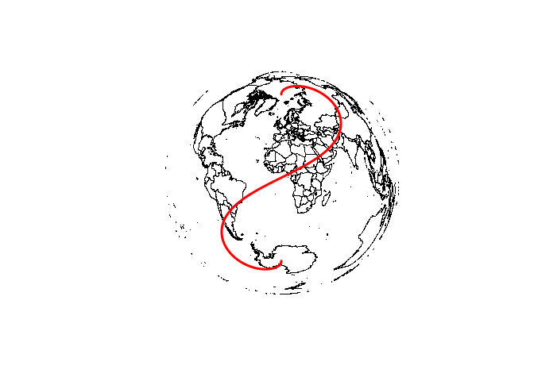
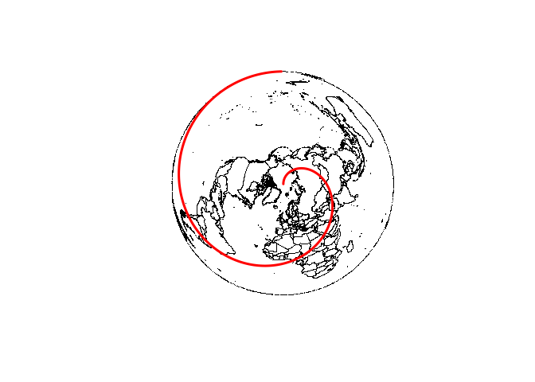
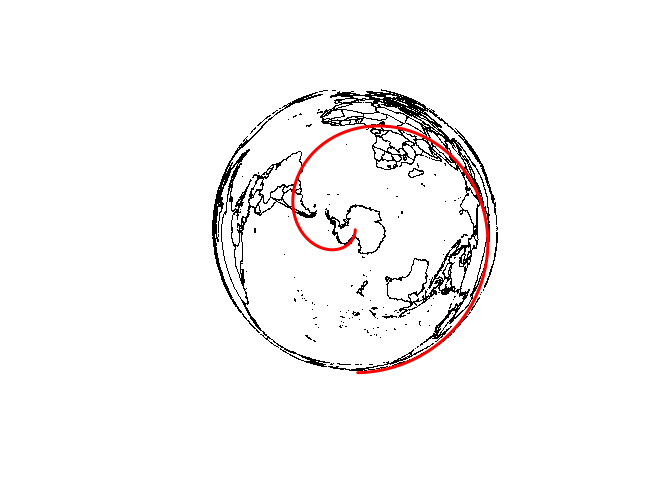
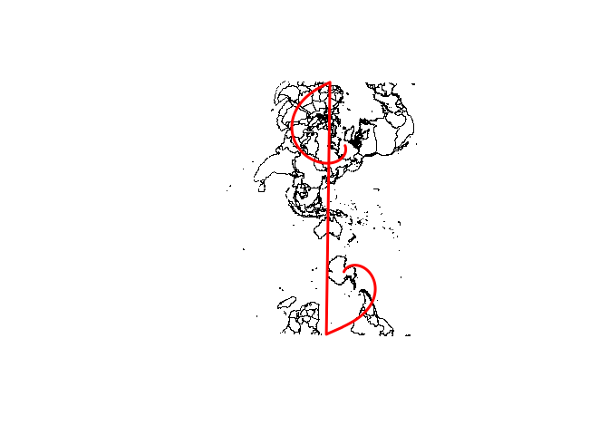

<!-- README.md is generated from README.Rmd. Please edit that file -->

# glod

<!-- badges: start -->

[](https://github.com/mdsumner/glod/actions/workflows/R-CMD-check.yaml)
<!-- badges: end -->

The goal of glod is to plot the Geographer’s Line of Death.

## Installation

You can install the development version of glod like so:

``` r
pak::pak("mdsumner/glod")
```

## Example

This is a basic example which shows you how to solve a common problem:

``` r
library(glod)
## basic example code
glod()
```



``` r

glod("+proj=laea +lat_0=90")
#> Error detected, some values Inf (error code: 2050)
#> 
#> ' Point outside of projection domain
#> 
#>  '
```



``` r
glod("+proj=laea +lat_0=-90")
#> Error detected, some values Inf (error code: 2050)
#> 
#> ' Point outside of projection domain
#> 
#>  '
```



``` r

## get just the data with plot = FALSE
str(glod("+proj=tmerc +lon_0=147", plot = FALSE))
#>  num [1:361, 1:2] 2.12e-10 3.12e+04 6.41e+04 9.85e+04 1.34e+05 ...
#>  - attr(*, "dimnames")=List of 2
#>   ..$ : NULL
#>   ..$ : chr [1:2] "x_" "y_"

## lots of fun!
glod("+proj=omerc +lonc=157 +lat_0=-42 +alpha=1")
```



## TODO

- stop those PROJ error messages …
- put a radius on the extent so you can see more projections
- integrate with {bigcurve} so the line is just-dense-enough

## Code of Conduct

Please note that the glod project is released with a [Contributor Code
of
Conduct](https://contributor-covenant.org/version/2/1/CODE_OF_CONDUCT.html).
By contributing to this project, you agree to abide by its terms.
